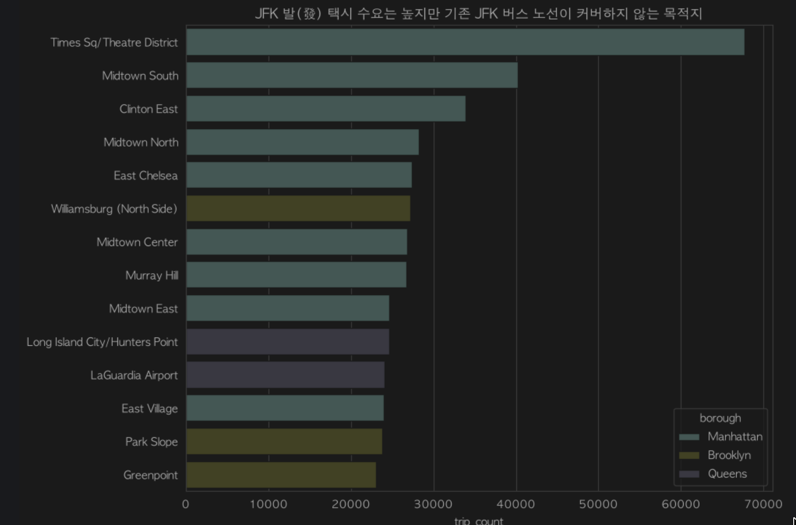
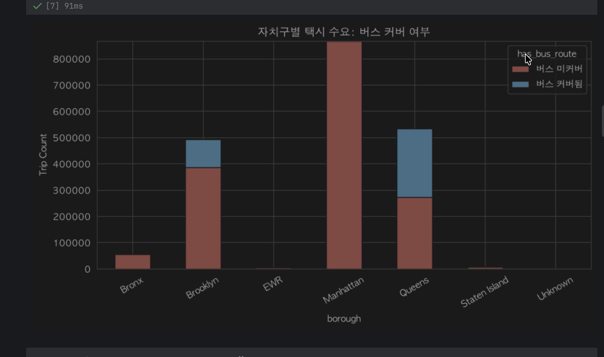
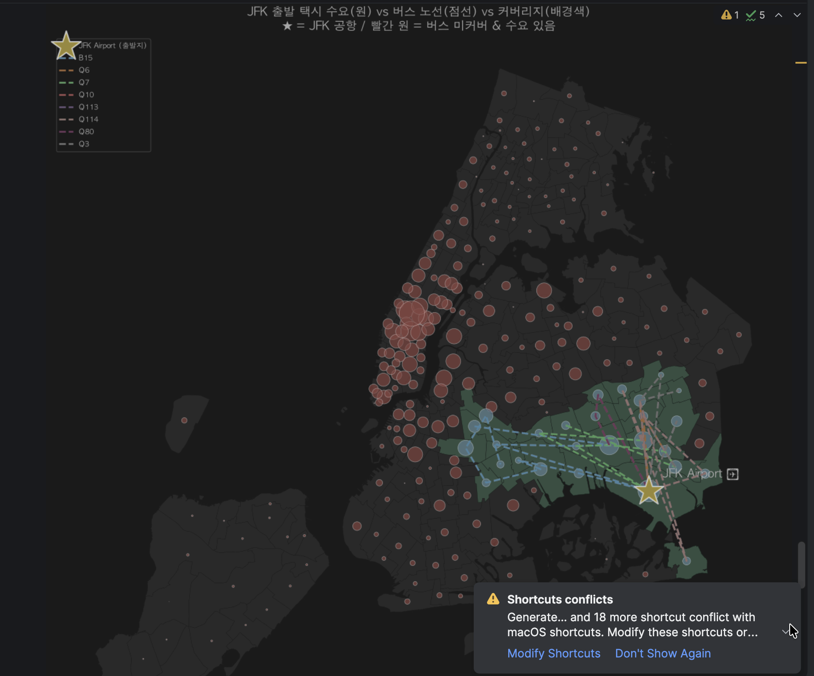
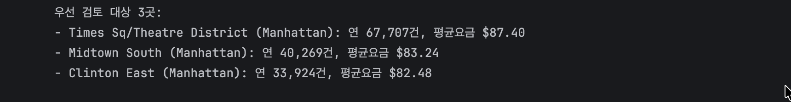
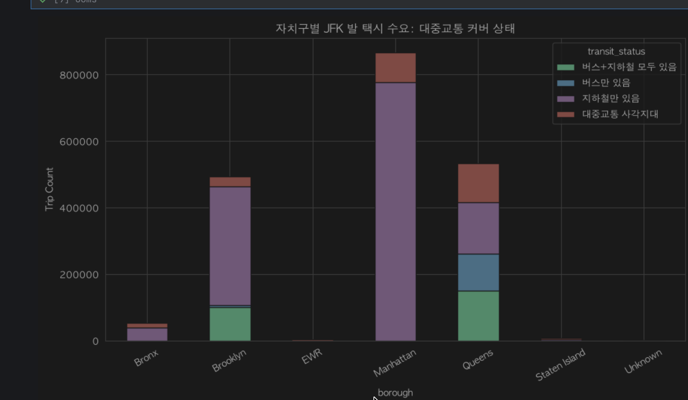
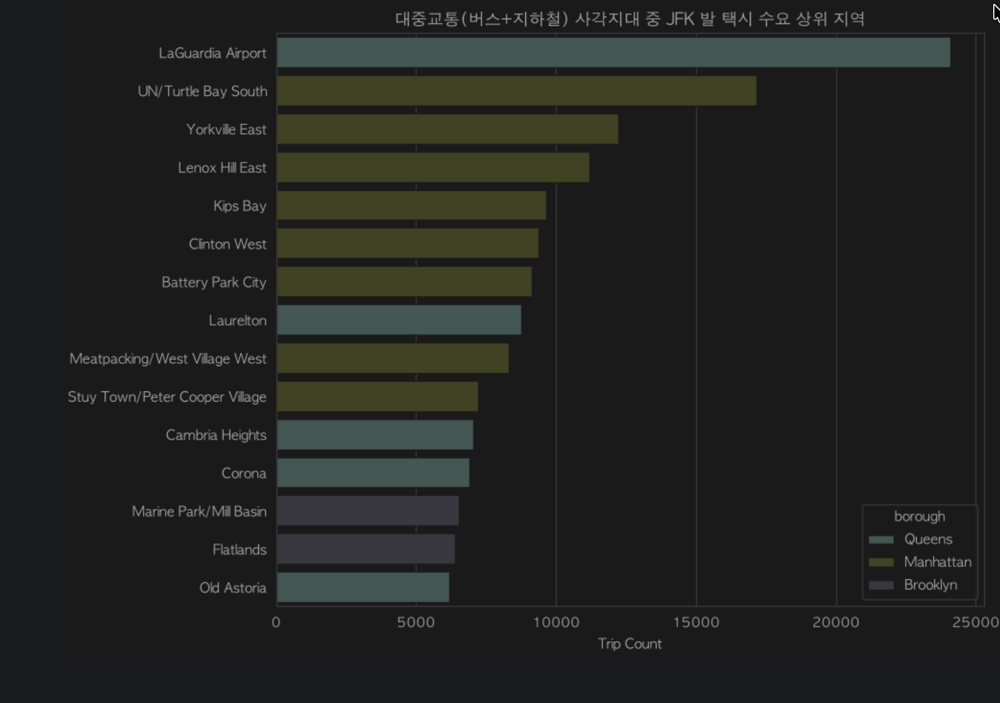
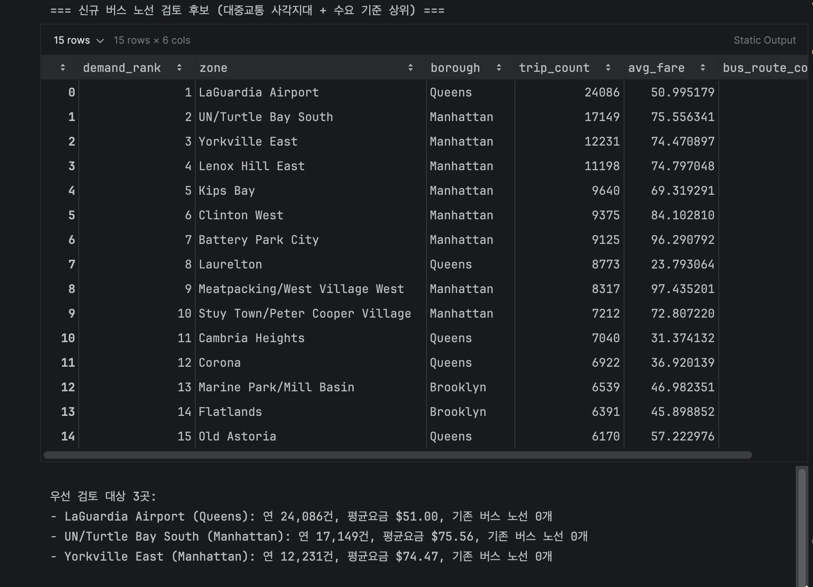

# JFK 공항 출발 택시 수요 기반 대중교통(버스) 사각지대 분석

JFK 공항에서 출발하는 Yellow Taxi / HVFHV(Uber·Lyft 등) 트립 데이터를 Apache Spark로 수집·정제·집계하고, 목적지 Zone의 버스·지하철 커버리지와 비교하여 **택시 수요는 높지만 대중교통(버스+지하철) 공급이 부족한 지역**을 찾아 신규 버스 노선 후보를 제안하는 데이터 프로젝트입니다.

## 비즈니스 배경

> "공항에서 출발하는 택시 수요 데이터를 기반으로, 특정 지역행 수요는 매우 높음에도 불구하고 버스 노선 자체가 다니지 않는 지역을 찾아내어, 버스 회사에 신규 노선 신설을 제안하는 데이터 상품"

- **왜 JFK인가**: TLC 데이터 내 픽업 건수가 가장 많아 통계적 유의성 확보에 유리하고, 국제선 중심 공항 특성상 초행 승객 비율이 높아 신규 버스 노선 제안 시나리오와 잘 맞는다.
- **왜 Yellow Taxi + HVFHV(Uber/Lyft)인가**: JFK 지상교통에서 Yellow Taxi의 시장 점유율이 과거 60%대에서 최근 약 18%까지 하락했고, 나머지 대부분을 HVFHV가 차지한다. Yellow Taxi만 보면 실제 수요의 일부만 반영되어 분석 신뢰도가 떨어지므로 두 서비스를 합쳐서 본다.

## 아키텍처

`docker-compose`로 Spark Standalone 클러스터(master + worker 2대)와 Jupyter(pandas/geopandas) 컨테이너를 함께 띄웁니다. 택시 데이터 집계(`jfk_zone_stats.py`)만 Spark 배치 스크립트로 처리하고, 버스·지하철 커버리지 산출(`nyc_bus_route.py`, `subway_zone_coverage.py`)은 Spark 없이 pandas/geopandas로 처리합니다. 지리 정보 처리·시각화·최종 분석은 Jupyter 노트북(`notebooks/`)에서 수행합니다.

```
                 spark-net (docker bridge)
┌───────────────┬────────────────┬────────────────┐
│  spark-master  │ spark-worker-1 │ spark-worker-2 │   ./jobs        -> /opt/spark-apps
│   (7077/8080)  │    (8081)      │    (8082)      │   ./data        -> /opt/spark-data
├───────────────┴────────────────┴────────────────┤   ./output      -> /opt/spark-output
│                     jupyter (8888)               │   ./notebooks   -> /home/jovyan/work
└──────────────────────────────────────────────────┘
```

- `jfk_zone_stats.py` (Spark) : JFK 출발 트립을 목적지 Zone별로 집계한 CSV 생성
- `nyc_bus_route.py` (pandas/geopandas) : GTFS 버스 노선 데이터에서 JFK 통과 노선의 Zone 커버리지 JSON 생성
- `subway_zone_coverage.py` (pandas/geopandas) : GTFS 지하철 stops 데이터에서 Zone별 지하철역 유무 CSV 생성
- `notebooks/JFK_bus_gap_analysis.ipynb` : 위 3개 산출물을 결합해 대중교통 사각지대·신규 노선 후보 도출 및 지도 시각화

## 디렉터리 구조

```
W4M2/
├── docker-compose.yml       # Spark 클러스터 + Jupyter 실행 정의
├── Dockerfile               # Spark master/worker 공용 이미지
├── Dockerfile.jupyter       # Jupyter(분석/시각화) 이미지
├── requirements.txt         # Jupyter 컨테이너 전용 파이썬 패키지
├── submit.sh                # jobs/*.py를 spark-submit으로 제출하는 스크립트
├── jobs/                    # Spark / 파이썬 배치 스크립트
│   ├── jfk_zone_stats.py
│   ├── nyc_bus_route.py
│   └── subway_zone_coverage.py
├── notebooks/               # 분석·시각화 Jupyter 노트북
│   ├── jkf_moving.ipynb
│   └── JFK_bus_gap_analysis.ipynb
├── data/                    # 입력 데이터 (parquet, GTFS, shapefile 등 직접 준비)
│   └── taxi_zones.geojson
├── images/                  # README용 분석 결과 스크린샷 (버스만 vs 버스+지하철 비교)
└── output/                  # 파이프라인 산출물
    ├── jfk_zone_stats/jfk_zone_stats.csv
    ├── bus_data/route_zone_coverage.json
    ├── subway_data/subway_zone_coverage.csv
    ├── jfk_bus_gap_map.png
    └── jfk_transit_gap_map.png
```

## 사전 준비: 데이터 파일

`data/`에 아래 원본 파일들을 직접 내려받아 배치해야 합니다(용량 문제로 저장소에는 포함하지 않음).

| 파일 | 출처 | 용도 |
|---|---|---|
| `yellow_tripdata_*.parquet` | [NYC TLC Trip Record Data](https://d37ci6vzurychx.cloudfront.net/trip-data/) | `jfk_zone_stats.py` 입력 |
| `fhvhv_tripdata_*.parquet` | NYC TLC Trip Record Data | `jfk_zone_stats.py` 입력 |
| `taxi_zone_lookup.csv` | NYC TLC 배포 페이지 | LocationID → Zone/Borough 매핑 |
| `taxi_zones.geojson` / `taxi_zones.shp` | NYC TLC GIS 데이터 | Zone 폴리곤(공간 조인, 지도 시각화) |
| GTFS Static (버스: `gtfs_q`, `gtfs_b`, `gtfs_busco` 등) | [MTA GTFS 배포 페이지](https://new.mta.info/developers) | `nyc_bus_route.py` 입력 |
| GTFS Static (지하철 `stops.txt`) | MTA GTFS 배포 페이지 | `subway_zone_coverage.py` 입력 |

## 실행 방법

### 1. Spark 클러스터 + Jupyter 기동

```bash
cd W4M2
docker-compose up -d --build
```

- Spark Master UI: http://localhost:8080
- Worker UI: http://localhost:8081, http://localhost:8082
- Jupyter Lab: http://localhost:8888

### 2. Spark job 실행 (목적지 Zone별 집계)

`data/`에 parquet + `taxi_zone_lookup.csv`를 준비한 뒤, 컨테이너 내부에서 `spark-submit`을 실행하는 `submit.sh`를 사용합니다.

```bash
./submit.sh jfk_zone_stats.py
# 이상치 컷오프(%) 등 옵션 지정
./submit.sh jfk_zone_stats.py --outlier-pct 2.0
# spark-submit 리소스는 환경변수로 조정 가능
EXECUTOR_MEMORY=4g CORES_MAX=8 ./submit.sh jfk_zone_stats.py
```

결과는 로컬 기준 `./output/jfk_zone_stats/`(컨테이너 기준 `/opt/spark-output/jfk_zone_stats`)에 단일 CSV로 저장됩니다.

### 3. 버스/지하철 커버리지 생성

Spark가 아닌 로컬 Python(또는 Jupyter 컨테이너) 환경에서 실행합니다. `requirements.txt`에 명시된 `geopandas`, `pandas`, `shapely`, `pyproj` 등이 필요합니다.

```bash
python jobs/nyc_bus_route.py \
  --gtfs ./gtfs_q ./gtfs_b ./gtfs_busco \
  --zones ./data/taxi_zones.shp \
  --out ./output/bus_data/route_zone_coverage.json

python jobs/subway_zone_coverage.py \
  --stops ./gtfs_subway/stops.txt \
  --zones ./data/taxi_zones.shp \
  --lookup ./data/taxi_zone_lookup.csv \
  --out ./output/subway_data/subway_zone_coverage.csv
```

### 4. 분석 및 시각화

`notebooks/JFK_bus_gap_analysis.ipynb`을 Jupyter Lab(http://localhost:8888)에서 열어 실행합니다. `jfk_zone_stats.csv`, `route_zone_coverage.json`, `subway_zone_coverage.csv`를 로드해 대중교통 상태를 4단계(버스+지하철 모두 있음/버스만/지하철만/사각지대)로 분류하고, 사각지대 중 택시 수요 상위 Zone과 지도 시각화 결과를 도출합니다.

## 산출물

| 파일 | 설명 |
|---|---|
| `output/jfk_zone_stats/jfk_zone_stats.csv` | 목적지 Zone별 트립 건수·평균/합계 주행거리·평균/합계/중앙값 요금 |
| `output/bus_data/route_zone_coverage.json` | JFK 통과 버스 노선별 커버 Zone 목록 |
| `output/subway_data/subway_zone_coverage.csv` | Zone별 지하철역 유무 및 역 개수 |
| `output/jfk_bus_gap_map.png`, `output/jfk_transit_gap_map.png` | 버스/대중교통 사각지대 지도 시각화 결과 |

## 분석 과정 및 핵심 발견

### 1단계: 버스 커버리지만으로 사각지대 탐색

JFK발 택시 수요(`jfk_zone_stats.csv`, 261개 목적지 Zone)와 JFK 접근 버스 노선 8개(`route_zone_coverage.json`, 커버 Zone 27개)만 비교해 "버스가 다니지 않는" 목적지를 1차로 뽑았다.

<table>
<tr>
<td width="50%">


*버스만 고려 — JFK발 수요는 높지만 버스 노선이 없는 상위 목적지*

</td>
<td width="50%">


*버스만 고려 — 자치구별 버스 커버 여부*

</td>
</tr>
</table>


*버스 노선(점선)과 버스 미커버·수요 존재 지역(빨간 원)을 지도에 표시. 맨해튼 전역이 온통 빨간 원 — 버스만 보면 맨해튼 대부분이 사각지대로 보인다.*

이 시점에는 **타임스퀘어(Times Sq/Theatre District, 연 67,707건, JFK발 2위 목적지)** 같은 대형 목적지도 버스 미커버 지역으로 잡혀, 아래처럼 우선 검토 대상 1~3위가 모두 맨해튼 도심부로 뽑혔다.


*버스만 고려했을 때의 우선 검토 대상 3곳 — Times Sq/Theatre District, Midtown South, Clinton East*

### 2단계: 지하철 커버리지 추가 → 오탐 제거

버스만으로 판단하면 실제로는 지하철로 충분히 커버되는 지역까지 "사각지대"로 오판할 수 있다고 보고, `subway_zone_coverage.py`로 만든 지하철역 커버리지(265개 Zone)를 결합해 버스·지하철 여부를 4단계로 재분류했다.


*버스+지하철 반영 후 자치구별 대중교통 상태(4단계). 맨해튼 대부분이 보라색("지하철만 있음")으로 바뀌어, 1단계에서 빨갛게 보였던 사각지대 상당수가 실제로는 지하철로 커버되고 있었음이 드러난다.*

| 대중교통 상태 | Zone 수 | 총 트립 수 | 평균 요금 |
|---|---:|---:|---:|
| 지하철만 있음 | 148 | 1,330,338 | $73.10 |
| **대중교통 사각지대(버스·지하철 모두 없음)** | 85 | 612,594 | $67.33 |
| 버스+지하철 모두 있음 | 17 | 251,102 | $32.45 |
| 버스만 있음 | 10 | 116,521 | $26.50 |

재분류 결과, 1단계에서 우선 검토 대상 1~3위였던 **타임스퀘어(지하철역 6개), Midtown South, Clinton East가 모두 지하철로 커버되어 사각지대에서 제외**되었다. 버스 지표 하나만으로 노선 제안을 했다면, 이미 지하철로 접근 가능한 지역에 불필요한 버스 노선을 제안할 뻔한 셈이다. → 대중교통 전체(버스+지하철)를 함께 봐야 진짜 사각지대를 가려낼 수 있다는 것이 이번 분석의 핵심 교훈이다.

### 3단계: 진짜 사각지대 상위 목적지

`Outside of NYC` 등 실지역이 아닌 값을 제외하고, 버스·지하철 모두 없는 85개 Zone을 JFK발 수요 순으로 정렬한 상위 목적지는 다음과 같다.

| 순위 | 목적지 | 자치구 | 연간 트립 수 | 평균 요금 | 기존 버스 노선 수 |
|---:|---|---|---:|---:|---:|
| 1 | **LaGuardia Airport** | Queens | 24,086 | $50.99 | 0 |
| 2 | UN/Turtle Bay South | Manhattan | 17,149 | $75.56 | 0 |
| 3 | Yorkville East | Manhattan | 12,231 | $74.47 | 0 |
| 4 | Lenox Hill East | Manhattan | 11,198 | $74.80 | 0 |
| 5 | Kips Bay | Manhattan | 9,640 | $69.32 | 0 |


*버스+지하철 모두 고려한 최종 사각지대 상위 목적지 — 맨해튼 도심부가 빠지고 1위는 LaGuardia Airport*


*버스 노선(점선) + 지하철역(사각형, 역 개수 비례) + 대중교통 상태(배경색)를 함께 표시한 최종 지도. 1단계 지도에서 온통 빨갛던 맨해튼이 보라색(지하철만 있음)으로 정리되고, 남은 빨간 원은 JFK 인근 LaGuardia Airport 등 소수 지역으로 좁혀진다.*


*최종 신규 버스 노선 검토 후보 15곳과 우선 검토 대상 3곳(LaGuardia Airport, UN/Turtle Bay South, Yorkville East) — 버스+지하철 사각지대 기준*

(전체 상위 15곳은 `notebooks/JFK_bus_gap_analysis.ipynb`의 "최종 신규 노선 후보 요약" 섹션 참고)

## 비즈니스 제안: JFK ↔ LaGuardia 직행 버스 노선

1위 사각지대인 **라과디아 공항(LaGuardia Airport)** 은 특히 주목할 만하다.

- JFK와 LaGuardia는 **같은 뉴욕시 공항이지만 두 공항 사이를 잇는 직항 항공편이 없다.**
- 현재는 대중교통으로 이동하려면 **버스·지하철을 여러 번 환승**해야 하는 불편이 있는데도, JFK발 택시 수요만 연 24,086건에 달하고 평균 요금은 $50.99 수준으로 두 공항 간 이동 수요와 지불 의사가 이미 확인된다.
- 따라서 **JFK ↔ LaGuardia 공항 간 직행 버스 노선을 신설**하면, 환승 없이 두 공항을 오갈 수 있어 환승객·항공사 직원 등 수요자 만족도를 크게 높이고, 버스 회사 입장에서도 검증된 수요를 가진 신규 노선을 확보할 수 있다.
- UN/Turtle Bay South, Yorkville East 등 나머지 상위 후보들도 버스 회사가 신규 노선 신설을 검토할 수 있는 2차 우선순위 노선으로 함께 제안한다.

## 기술 스택

| 항목 | 사용 기술 |
|---|---|
| 분산 처리 | Apache Spark 3.5.0 (PySpark), Docker Compose Standalone 클러스터 |
| 지리 정보 처리 | geopandas, shapely, pyproj, pyogrio |
| 분석/시각화 | Jupyter Notebook, pandas, matplotlib, seaborn |
| GTFS 파싱 | gtfs-kit, partridge |
